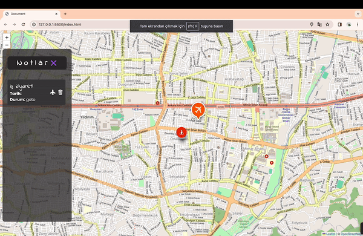

<h1> noteMap </h1>

This application, developed using the Leaflet map library along with HTML, CSS and JavaScript, is designed for adding notes on the left side and marking locations on the map on the right side.

<h2> The technologies used in the project </h2>

It was coded using;
Html, Css, JavaScript and Leaflet map library technologies.

<h2> Screenshot </h2>

# noteMap
# noteMap
